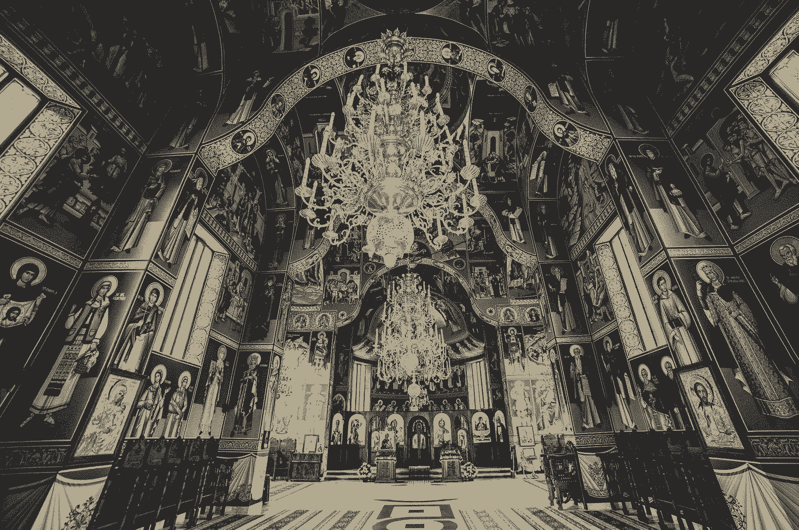

# Comparaison entre différents formats
100 images PNG + ImageMagick (RTFM) + chatGPT
## conversion en WebP 80
bash png2webp.sh 80 *.png
## conversion en WebP 60
bash png2webp.sh 60 *.png

## conversion en JPEG 80
bash png2jpeg.sh 80 *.png
## conversion en JPEG 60
bash png2jpeg.sh 60 *.png

## conversion en GIF 2 couleurs
bash png2gif.sh 2 *.png

## comparaison des tailles
- originaux en png : 446 Mo
- webp 80 : 39.3 Mo
- webp 60 : 26.4 Mo (le gagnant :)) 
- jpeg 80 : 50 Mo
- jpeg 60 : 32.6 Mo
- gif 2 couleurs : 33.2 Mo 

Les images viennent de ce dataset Kaggle :
https://www.kaggle.com/datasets/soumikrakshit/div2k-high-resolution-images
